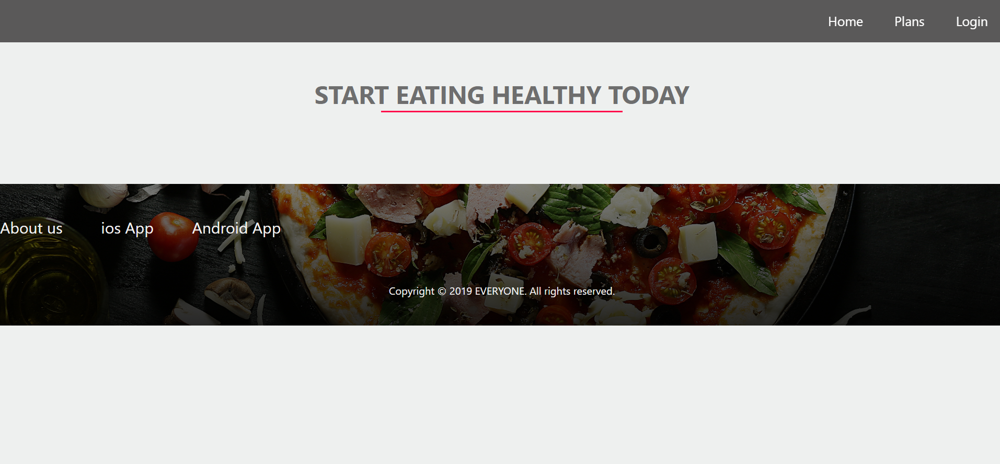
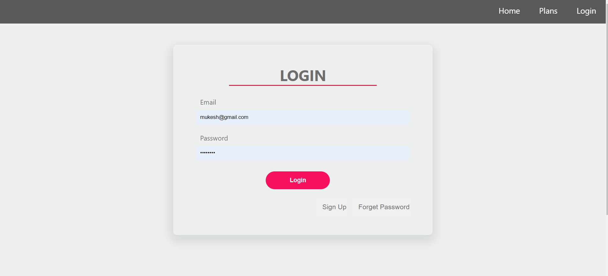
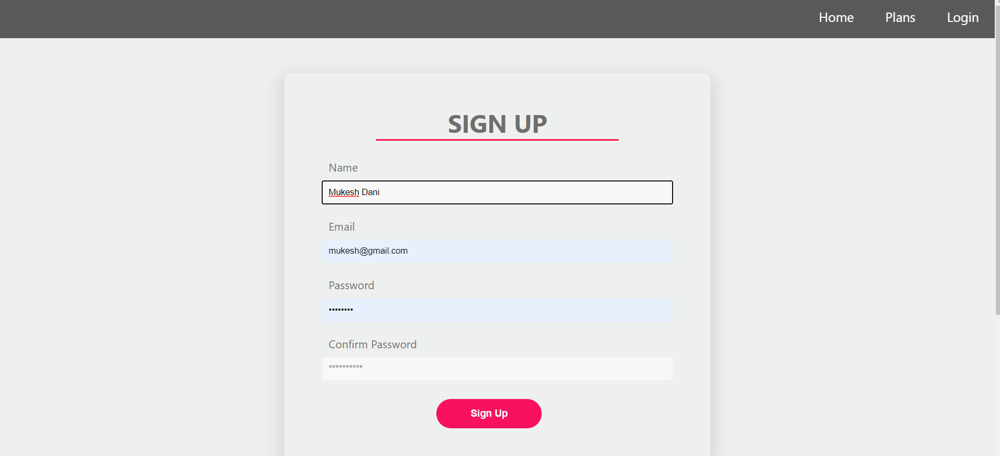

# Meal Plans delivery website -> EatFit clone

## Technology 👇
-React.js 
-Express.js

-Git Hub 
 ## Platform 👇

-[Frontend -> Netlify](https://app.netlify.com/)

-[Backend -> Heroku](https://nados.pepcoding.com/)

-[Codebase ->Github](https://github.com/mukeshdani/Meal-Plans-delivery-website)

-[Visual Studio code editor](https://code.visualstudio.com/)

-[Database server -> MongoDB Atlas](https://www.mongodb.com/cloud/atlas/register?utm_content=rlsapostreg&utm_source=google&utm_campaign=gs_apac_rlsamulti_search_brand_dsa_atlas_desktop_rlsa_postreg&utm_term=&utm_medium=cpc_paid_search&utm_ad=&utm_ad_campaign_id=14412646494&adgroup=131761134692&gclid=CjwKCAjwu5yYBhAjEiwAKXk_eL-0wZefUju-f_-BI5ytoZZRdsNsIJrMKdpT6OLul-umB2xyfYCMmBoCAwMQAvD_BwE)

### contact 
💼 Pull requests help you collaborate on code with me [issues and pull requests](https://github.com/mukeshdani/Data-Stractures-and-algorithms-/pulls) :)

 💼 if you have any doubt? do reach, [email](mailto:mukeshdani00@gmail.com) :)

## pages
* Home : 
    * Majorly Static
    * Top 3 Plans
    * Top 3 reviews
* User
  * Login Page
  * Signup Page
  * Forget Password
  * ResetPassword Page
  * Profile Page
      * user details : Email ,Name,img
      * Booked Plans
* Plans
  * All Plans
  * Plan Details
    * Discreption of the plan
    * Buy Now Button
    * Reviews  
## Backend Architecture:  MVC architecture, REST API
## Database : MongoDb,Mongoose
## Authentication : Json web token 
## 3rd party : 
        * Payment GateWay:RazorPay
        * Email:  nodemailer,gmail
## Testing : Postman
## Frontend : React, Backend : Express
## Deployment : 
    * Backend :Heroku 
    * Frontend : Netlify
    * Codebase : Github
    * Database server : MongoDB Atlas 
* Futher improvement : videos, feedback ,meal level  

## Home Page 

## Plans

## Login

## SignUp
